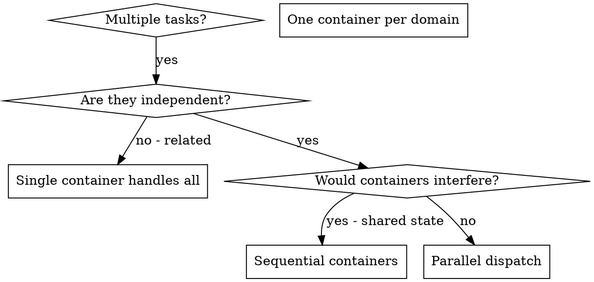

# Dispatching Parallel Agents

## Overview

When you have multiple unrelated tasks (different test files, different subsystems, different features), working them sequentially wastes time. Each task is independent and can happen in parallel — in separate container environments.

**Core principle:** Dispatch one container per independent problem domain. Let them work concurrently.

## When to Use



**Use when:**
- 3+ test files failing with different root causes
- Multiple subsystems broken independently
- Each problem can be understood without context from others
- No shared state between investigations

**Don't use when:**
- Failures are related (fix one might fix others)
- Need to understand full system state
- Containers would interfere (editing same files)

## The Pattern

### 1. Identify Independent Domains

Group tasks by what's broken:
- File A tests: Tool approval flow
- File B tests: Batch completion behavior
- File C tests: Abort functionality

Each domain is independent — fixing tool approval doesn't affect abort tests.

### 2. Create Focused Container Tasks

Each container gets:
- **Specific scope:** One test file or subsystem
- **Clear goal:** Make these tests pass
- **Constraints:** Don't change other code
- **Commit when done:** Work is tracked on container's branch

### 3. Dispatch to Containers

Each independent task runs in its own isolated container environment:

```
Container 1 → Fix agent-tool-abort.test.ts
Container 2 → Fix batch-completion-behavior.test.ts
Container 3 → Fix tool-approval-race-conditions.test.ts
```

All three run concurrently in isolation.

### 4. Monitor Progress

Tell the user how to track container work:

```
To see all environments: container-use list
To watch progress: container-use watch {id}
To see command history: container-use log {id}
```

### 5. Review and Integrate

When containers complete, guide the user through review and merge:

```
Container work complete. To review and integrate:

1. Review each container's changes:
   container-use diff {id1}
   container-use diff {id2}
   container-use diff {id3}

2. Merge each (after review):
   container-use merge {id1}
   container-use merge {id2}
   container-use merge {id3}

3. Run full test suite on merged result
```

## Task Prompt Structure

Good container task prompts are:
1. **Focused** — One clear problem domain
2. **Self-contained** — All context needed to understand the problem
3. **Commit when done** — Work tracked on branch

```markdown
Fix the 3 failing tests in src/agents/agent-tool-abort.test.ts:

1. "should abort tool with partial output capture" - expects 'interrupted at' in message
2. "should handle mixed completed and aborted tools" - fast tool aborted instead of completed
3. "should properly track pendingToolCount" - expects 3 results but gets 0

These are timing/race condition issues. Your task:

1. Read the test file and understand what each test verifies
2. Identify root cause - timing issues or actual bugs?
3. Fix by:
   - Replacing arbitrary timeouts with event-based waiting
   - Fixing bugs in abort implementation if found
   - Adjusting test expectations if testing changed behavior

Do NOT just increase timeouts - find the real issue.

Commit when tests pass.
```

## Common Mistakes

**❌ Too broad:** "Fix all the tests" — agent gets lost
**✅ Specific:** "Fix agent-tool-abort.test.ts" — focused scope

**❌ No context:** "Fix the race condition" — agent doesn't know where
**✅ Context:** Paste the error messages and test names

**❌ Skip monitoring:** Assume containers succeeded
**✅ Verify:** Use `container-use diff` and `log` before merging

**❌ Merge without review:** Just run `merge` for all containers
**✅ Review each:** Check diff for each container before merging

## When NOT to Use

**Related failures:** Fixing one might fix others — investigate together first
**Need full context:** Understanding requires seeing entire system
**Exploratory debugging:** You don't know what's broken yet
**Shared state:** Containers would interfere (editing same files)

## Key Benefits

1. **True isolation** — Each container has its own branch, no interference
2. **Parallelization** — Multiple investigations happen simultaneously
3. **Visibility** — Full command history via `container-use log`
4. **Safe integration** — Review with `diff` before merging

## Verification

Before merging containers:

1. **Review each diff** — `container-use diff {id}` for each
2. **Check for conflicts** — Did containers edit same files?
3. **Merge sequentially** — `container-use merge {id}` one at a time
4. **Run full suite** — Verify all fixes work together

## Integration

**Uses:**
- **monitoring-container-agents** — Track container progress
- **verification-before-completion** — Verify before claiming success
- **finishing-a-development-branch** — For final merge decisions
